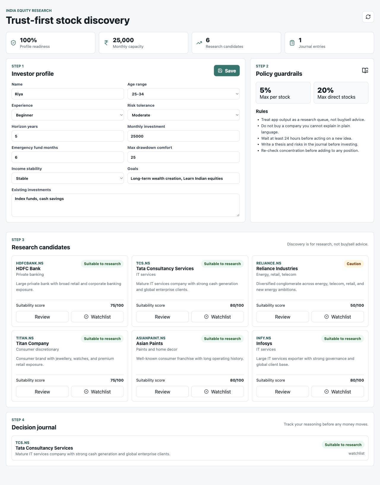
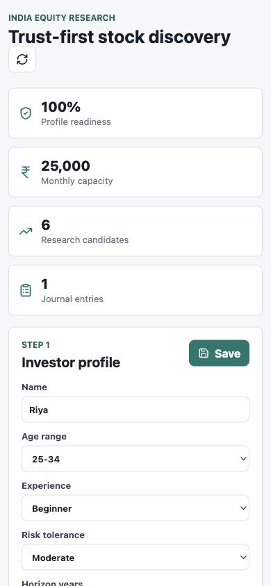

# India Stock Discovery Agent

A trust-first Indian equity research app that helps beginner investors build a profile, apply suitability guardrails, discover stocks to research, and journal decisions before money moves.



<p align="center">
  
</p>

## Why It Stands Out

- Turns investor suitability into deterministic Python guardrails instead of hiding risk checks inside prompts
- Separates stock discovery from investment advice with clear labels, scores, reasons, risks, and next steps
- Includes a decision journal so users capture their thesis before acting
- Ships as a full-stack app with a FastAPI backend, local SQLite persistence, and a Vite React dashboard
- Focuses on Indian equities and beginner-friendly research workflows

## What It Does

- Captures an investor profile: goals, horizon, risk tolerance, emergency fund, income stability, and drawdown comfort
- Generates an investment policy with position sizing and concentration rules
- Shows Indian stock research candidates with suitability labels and scores
- Saves a local decision journal for watchlist/skipped/bought ideas
- Keeps the user interface responsive for desktop and mobile review

The app is a research and learning assistant. It does not provide buy/sell recommendations.

## Tech Stack

- FastAPI
- SQLite
- Pydantic
- React
- TypeScript
- Vite

## Run Locally

Install dependencies:

```bash
make setup
```

Start the backend:

```bash
make api
```

In another terminal, start the web app:

```bash
make web
```

Open:

```text
http://localhost:3000
```

The API runs at:

```text
http://localhost:8000
```

Local app data is stored in `data/app.db`. This file is ignored by Git.

## Optional AgentOS Prototype

An experimental Agno AgentOS entrypoint is available for xAI-backed research workflows:

```bash
make legacy-agent
```

For the legacy agent, add your xAI key to `.env`:

```bash
echo "XAI_API_KEY=your-api-key-here" > .env
```

## Validation

Build the frontend:

```bash
cd frontend && npm run build
```

Check the API health endpoint after starting the backend:

```bash
curl http://localhost:8000/health
```

## License

See [LICENSE](LICENSE).
